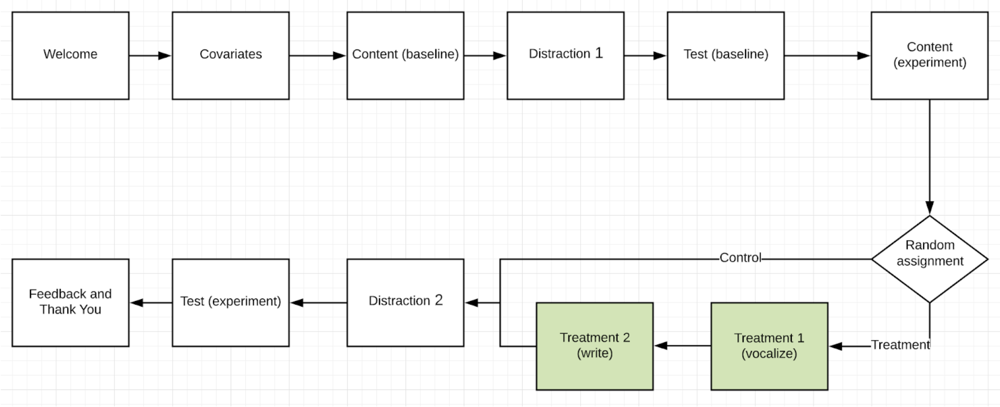
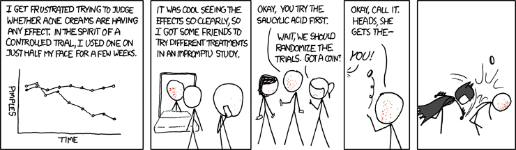

\raggedright
\setcounter{tocdepth}{2}
\tableofcontents

```{r setup, include=FALSE}
knitr::opts_chunk$set(echo = TRUE)
#import libraries
library(dplyr)
library(anytime)
library(lubridate)
library(tidyr)
library(ggplot2)
library(ggpubr)
library(stargazer)
library(sandwich)
library(lmtest)
options(scipen=999)
```

```{r echo=FALSE, child='code.Rmd'}
```

\pagebreak
# Introduction

## Background
Rote memorization has a bad name in pedagogy, causing teachers to stay away from it and students to feel free to never practice it. However, in mathematics, physics, computer science, and other sciences, being able to recall certain snippets of knowledge quickly is imperative for both being able to perform calculations, for writing code in reasonable time, and to recognize patterns and form one’s own “grammatical ability” to formulate approaches. It isn’t really possible to imagine what a forest looks like, and how you would navigate it, until you can effortlessly recall what a tree is. Often, there are only a handful of vital concepts that a student needs to recall, but those they need to recall with absolutely no expenditure of time or doubt.

Teachers have, at times, built little structured exercises into their curricula to help students remember such snippets. One technique is for the student to read the fact/formula/code in question so that they have a memory of seeing the thing, writing it down in their own hand (or typing it, but I prefer hand-writing for this) so they have a memory of writing it, and lastly saying it out loud multiple times so they have memory of saying it.

This is all good and nice, but can we substantiate the validity of these techniques with an experiment? In other words, “is using multiple ways of remembering the same concept effective in aiding retention?” 

## Intuition

The justification for the memorization approach tested here comes mainly out of intuition. When we remember a line in a song, we don’t remember just the words, we remember the sound of the vocalist singing them. When we remember a vacation at a beach, we remember the color of the sky and the sound of the waves and birds, not the abstract concepts “there were birds, the sky was blue”. Instead, we reconstruct these abstract concepts from our memory of the experience of our senses. 

When we need to memorize purely abstract concepts for their own sake, we can manufacture sense experiences by saying them out loud and writing them down (this might be less true for writing on a computer compared to paper and pencil, but stick with us here). It is our hope that these sense memories will be easier to recall, and aid the student in producing the right abstract facts to go along with them. 

## Hypothesis

Our specific hypothesis is, then, that students memorizing content by vocalizing them and writing them down should see a significantly higher score when evaluated over multiple such exercises, compared to students who only read the content quietly.

\pagebreak
# Experiment Design

## Basic Structure

There were 2 portions of our test. The first portion was a “baseline” portion, where study participants would be presented 2 passages. The second portion would consist of the actual experiment, where our study participants would then be randomized into “treatment” or “control” groups.



Subjects were randomly assigned 2 topics in both Part 1 and Part 2 from a pool of 8 questions ranging from topics from “Units for the Calorie Content of Food'' to the “History of the Submarine”. After reading each passage, they were given a video distraction and then given 4 multiple choice questions on what they had read. Screen shots are provided in the appendix with sample passages and questions that people were presented with

## Test Subjects

Since one of our team members is a high school teacher in Washington state, we decided to solicit the students of this school to participate in this experiment. Due to a need for additional study participants, all of the team members also solicited people on social media, as well as family and friends in order to participate in this experiment, rounding out our "considered" subjects. "Assigned" were subjects who at least made it as far as entering and submitting covariants. Since there was major attrition beyond that point, the "actually evaluated" subjects are only those who completed the whole test. We have detailed data about which subjects attrited at what point, and can compute an average treatment effect on the treated (ATET).

The actual age distribution of participant who completed the test is displayed in the results section. Middle school to high school age range accounted for around a third of the total participants. The rest were distributed between the 20 to 80 years old, and the older portion skews toward the female gender.

## Comparison of Potential Outcomes 

The format of our experiment was a multiple choice test. Study participants would read a passage for a predetermined amount of time (generally around 2 minutes per passage, depending on length), and would subsequently be presented with a set of multiple choice questions. 

## Randomization Process

Participants were assigned to "control" and "treatment" group randomly. The software did this right after covariates were gathered. In anticipation of collusion between students, we decided to cluster by time slot, in 5-minute increments. In hindsight, this was not necessary given our randomized draw from a question bank which made spillover effects unlikely, but it also did not hurt our process or errors too much. Students by-and-large took the tests in different time slots.

## Treatment

todo: [2 screenshots, one from treatment and one from control]

The treatment of this experiment is in Part 2. The participants in the treatment group will read 2 passages with 4 questions for each passage that they will answer later on. At the top of the screen, there is instruction to read the answers to the questions shown out loud 5 times. This allows the participants to have repeated memory of speaking the concept. On the screen after, the participants will be shown the same passages and questions. At the top of this screen, there is instruction for participants to read the passage again and type out brief answers to the questions. This allows the participants to have written memory of the concept. Showing the passages and instructing the participants to read the passages on 2 different screens allows them to have repeated memory of seeing the concept. The treatment as a whole allows the participants to have repeated memory of seeing and speaking the concept and written memory of the concept and therefore tests our hypothesis. After these 2 screens, the participants will watch a 1 minute distraction video then go to a screen where they will select correct answers for the questions in multiple choice format. 

## Power Calculation

Prior to conducting our experiment, we used a ballpark estimate in order to estimate how many observations we would need. We used an online power calculator (https://www.stat.ubc.ca/~rollin/stats/ssize/n2.html) in order to estimate our necessary effect size. Given that each study participant would answer 8 questions (with 5 multiple choice options), we used a binomial distribution to estimate our value for $\sigma$ (arriving at an estimated $\sigma$ of $1.131$).

We estimated an effect size of getting one question right between treatment and control. With the experiment parameters of 0.05 and power calculation of .8, we estimated that we would need roughly 21 samples per group. 

In retrospect, this back of the envelope calculation was not extremely helpful. We would have benefited greatly from a pretest, however, due to a software bug, we were unable to properly assess the results of our pretest. In retrospect, our estimated effect size was far too high. People generally were able to score quite well on the exam regardless of if they were in treatment or control.

\pagebreak
# Analysis of Results

## Loading and Preprocessing the Data

```{r data_preprocessing, message=FALSE}
dataset = load_data()
dataset_control <- dataset %>% filter(treat == 0)
dataset_treat <- dataset %>% filter(treat == 1)
```

## EDA

```{r, results='asis'}
stargazer(dataset, header=FALSE)
```


```{r EDA, warning=FALSE}
plot_age()
```

## Randomization Checks

### Check by Regression

We used 2 methods to validate the randomization process worked. The first method is to create a regression model using covariate information collected to predict whether the participant was be assigned to control or treatment group. We created this regression model both for all participants who got assigned and for only participants who completed the survey. We concluded that the treatment assignment was random as none of the covariates had a significant predicting power. Details of the regression models are attached below.

```{r, results='asis'}
stargazer(cov_check_regression(), header=FALSE)
```

### Visual Check

The second method of validating randomization is to look at the distribution of control versus treatment assignment over participants’ age, gender, self-reported memorization skill, and self-reported reading skill. As shown in the graphs below, the distribution of control versus treatment assignment are fairly even among all the participant groups. Therefore, we validated the randomization worked.

```{r}
p1 = plot_rand_age()
p2 = plot_rand_reading()
p3 = plot_rand_gender()
p4 = plot_rand_practice()
ggarrange(p1,p2,p3,p4,
          labels = c("A","B","C","D"),
          ncol = 2, nrow = 2)
```

## Effect Calculation

todo: everything

```{r, results='asis'}
result_regressions()
```

\pagebreak
# Appendix

## Code

```{r child='code.Rmd'}
```

\pagebreak
\centering
&nbsp;  
&nbsp;  
&nbsp;  
&nbsp;  
&nbsp;  
&nbsp;  
&nbsp;  
&nbsp;  
&nbsp;  
&nbsp;  
&nbsp;  

https://xkcd.com/700/

