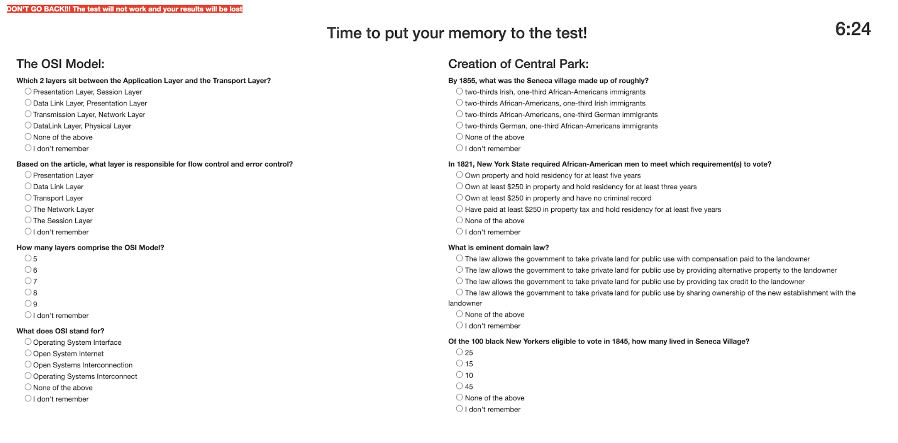

\raggedright
\setcounter{tocdepth}{2}
\tableofcontents

```{r setup, include=FALSE}
knitr::opts_chunk$set(echo = TRUE)
#import libraries
library(dplyr)
library(anytime)
library(lubridate)
library(tidyr)
library(ggplot2)
library(ggpubr)
library(stargazer)
library(sandwich)
library(lmtest)
library(png)
library(grid)
options(scipen=999)
```

```{r echo=FALSE, child='code.Rmd'}
```

\pagebreak
# Introduction

## Background
Rote memorization has a bad name in pedagogy, causing teachers to stay away from it and students to feel free to never practice it. However, in mathematics, physics, computer science, and other sciences, being able to recall certain snippets of knowledge quickly is imperative for both being able to perform calculations, for writing code in reasonable time, and to recognize patterns and form one’s own “grammatical ability” to formulate approaches. It isn’t really possible to imagine what a forest looks like, and how you would navigate it, until you can effortlessly recall what a tree is. Often, there are only a handful of vital concepts that a student needs to recall, but those they need to recall with absolutely no expenditure of time or doubt.

Teachers have, at times, built little structured exercises into their curricula to help students remember such snippets. One technique is for the student to read the fact/formula/code in question so that they have a memory of seeing the thing, writing it down in their own hand (or typing it, but I prefer hand-writing for this) so they have a memory of writing it, and lastly saying it out loud multiple times so they have memory of saying it.

This is all good and nice, but can we substantiate the validity of these techniques with an experiment? In other words, “is using multiple ways of remembering the same concept effective in aiding retention?” 

## Intuition

The justification for the memorization approach tested here comes mainly out of intuition. When we remember a line in a song, we don’t remember just the words, we remember the sound of the vocalist singing them. When we remember a vacation at a beach, we remember the color of the sky and the sound of the waves and birds, not the abstract concepts “there were birds, the sky was blue”. Instead, we reconstruct these abstract concepts from our memory of the experience of our senses. 

When we need to memorize purely abstract concepts for their own sake, we can manufacture sense experiences by saying them out loud and writing them down (this might be less true for writing on a computer compared to paper and pencil, but stick with us here). It is our hope that these sense memories will be easier to recall, and aid the student in producing the right abstract facts to go along with them. 

## Hypothesis

Our specific hypothesis is, then, that students memorizing content by vocalizing them and writing them down should see a significantly higher score when evaluated over multiple such exercises, compared to students who only read the content quietly.

\pagebreak
# Experiment design

## Basic structure

There were 2 portions of our test. The first portion was a “baseline” portion, where study participants would be presented 2 passages. The second portion would consist of the actual experiment, where our study participants would then be randomized into “treatment” or “control” groups.


Subjects were randomly assigned 2 topics in both Part 1 and Part 2 from a pool of 8 questions ranging from topics from “Units for the Calorie Content of Food'' to the “History of the Submarine”. After reading each passage, they were given a video distraction and then given 4 multiple choice questions on what they had read. Screen shots are provided in the appendix with sample passages and questions that people were presented with

## Test subjects

Since one of our team members is a high school teacher in Washington state, we decided to solicit the students of this school to participate in this experiment. Due to a need for additional study participants, all of the team members also solicited people on social media, as well as family and friends in order to participate in this experiment, rounding out our "considered" subjects. "Assigned" were subjects who at least made it as far as entering and submitting covariants. Since there was major attrition beyond that point, the "actually evaluated" subjects are only those who completed the whole test. We have detailed data about which subjects attrited at what point, and can compute an average treatment effect on the treated (ATET).

The actual age distribution of participant who completed the test is displayed in the results section. Middle school to high school age range accounted for around a third of the total participants. The rest were distributed between the 20 to 80 years old, and the older portion skews toward the female gender.

## Comparison of potential outcomes 

The format of our experiment was a multiple choice test. Study participants would read a passage for a predetermined amount of time (generally around 2 minutes per passage, depending on length), and would subsequently be presented with a set of multiple choice questions. Possible scores on each test ranges from 0 (fully incorrect) to 8 (fully correct). What we are interested in is the difference in score between the pre-test (before treatment) and the post-test (after treatment). For the control group, the expected difference between tests is 0 in an ideal world. In the real world, subjects might get tired between tests and score lower on the second part, or also might get warmed up to the process of memorization and testing and score higher. However, with proper randomization, the expected value of score difference between treatment and control should be 0 if the treatment has no effect. 

## Randomization process

Participants were assigned to "control" and "treatment" group randomly. The software did this right after covariates were gathered. In anticipation of collusion between students, we decided to cluster by time slot, in 5-minute increments. In hindsight, this was not necessary given our randomized draw from a question bank which made spillover effects unlikely, but it also did not hurt our process or errors too much. Students by-and-large took the tests in different time slots.

## Pre-treatment-phase content and test

The first part of the experiment is the same for control and treatment - two content items are displayed along with questions we intend to ask, then a distraction takes the subject's mind off the content for about a minute, and then we test the subject on the two topics with 4 questions per topic, with 5 possible choices for each question. This gives us 8 "correct"/"incorrect" scores, which we record as a "baseline" score.

## Treatment-phase content and test

The treatment of this experiment is in Part 2. The participants in the treatment group will read 2 passages with 4 questions for each passage that they will answer later on. At the top of the screen, there is instruction to read the answers to the questions shown out loud 5 times. This allows the participants to have repeated memory of speaking the concept. On the screen after, the participants will be shown the same passages and questions. At the top of this screen, there is instruction for participants to read the passage again and type out brief answers to the questions. This allows the participants to have written memory of the concept. Showing the passages and instructing the participants to read the passages on 2 different screens allows them to have repeated memory of seeing the concept. The treatment as a whole allows the participants to have repeated memory of seeing and speaking the concept and written memory of the concept and therefore tests our hypothesis. After these 2 screens, the participants will watch a 1 minute distraction video, then go to a screen where they will select correct answers for the questions in multiple choice format. We once again record their 8 correct/incorrect answers, this time marked as "experiment" scores. 

## Power calculation

Prior to conducting our experiment, we used a ballpark estimate in order to estimate how many observations we would need. We used an online power calculator (https://www.stat.ubc.ca/~rollin/stats/ssize/n2.html) in order to estimate our necessary effect size. Given that each study participant would answer 8 questions (with 5 multiple choice options), we used a binomial distribution to estimate our value for $\sigma$ (arriving at an estimated $\sigma$ of $1.131$).

We estimated an effect size of getting on average one additional question right between treatment and control. With the experiment parameters of 0.05 and power calculation of .8, we estimated that we would need roughly 21 samples per group. 

In retrospect, this back of the envelope calculation was not extremely helpful. We would have benefited greatly from a pretest, however, due to a software bug, we were unable to properly assess the results of our pretest. In retrospect, our estimated effect size was far too high. People generally were able to score quite well on the exam regardless of if they were in treatment or control.

todo: how much power did we actually have?

\pagebreak
# Analysis of results

We ended the experiment at a time we set several days in advance, after discussing that new participation had ebbed off and that without further marketing, we could not expect more, and none of us had any grand ideas for producing more subjects. The day we picked lined up with our initial time line. 

## Loading and preprocessing the data

```{r data_preprocessing, message=FALSE}
dataset = load_data()
dataset_long = load_data_long()
```

## EDA

```{r, echo=FALSE, results='asis'}
stargazer(dataset, header=FALSE)
```

At the end of the experiment, we had `r nrow(dataset[dataset$treat==0,])` subjects in control and `r nrow(dataset[dataset$treat==1,])` in treatment. 

```{r EDA, echo=FALSE, warning=FALSE}
plot_age()
```

In the age distribution of only people who completed the whole experiment, we can see a group of Eastside Prepartory School students under the age of 20, a female-leaning cluster of certain Facebook friends over the age of 50, and a mixed group of other social media recruits between those groups. Gender balance does not look bad. 

## Randomization checks

### Check by regression

We used 2 methods to validate the randomization process worked. The first method is to create a regression model using covariate information collected to predict whether the participant was be assigned to control or treatment group. We created this regression model both for all participants who got assigned and for only participants who completed the survey. We concluded that the treatment assignment was random as none of the covariates had a significant predicting power. Details of the regression models are attached below.

```{r, echo=FALSE, results='asis'}
stargazer(cov_check_regression(), header=FALSE)
```

### Visual check

The second method of validating randomization is to look at the distribution of control versus treatment assignment over participants’ age, gender, self-reported memorization skill, and self-reported reading skill. As shown in the graphs below, the distribution of control versus treatment assignment are fairly even among all the participant groups. Therefore, we validated the randomization worked.

```{r echo=FALSE}
plot_rand()
```

Did our question banks get randomized adequately? From a quick visual check, yes:

```{r}
plot_rand_qs()
```

Were some questions harder than others?

```{r}
plot_qs()
```

This is odd. We accept that some of our questions were harder than others, but a score of almost 0 for item 1 question 1 and item 3 question 1 is unlikely. Also, subjects in the treatment group had a harder time by far with item 6 question 1. 

The first two items we analyzed and corrected (details are in the appendix), here is the corrected data:

```{r}
correct_data() # makes a secondary CSV  
dataset = load_data(TRUE)
dataset_long = load_data_long(TRUE)
plot_qs()
```

Topic number 6 question 1 is also discussed in the appendix. Compared to the other two, this one seems to simply have been a difficult question. Here is the distribution of answers:

```{r}
plot_q_601()
```

The correct answer was indeed the most frequent, so there is no real reason to doubt this data point. 

### Glance at score distribution

As part of our EDA, we take a look at the distribution of differential (post-pre) scores between treatment and control:

```{r echo=FALSE}
plot_diffs_all()
```

We can see the distribution shifted to the positive in the treatment group, by about a little under a full score point. Let's see whether it holds up statistically.

## Effect calculation

As discussed above, one primary method of effect calculation for us was looking at the differences between pre- and post-treatment-phase scores. In this spirit, we now regress that difference on (1) only the treatment indicator `treat` and (2) on the treatment indicator along with a number of covariates to compute the ATET:

```{r, results='asis'}
result_regressions()
```

Disappointingly, the inclusion of covariates did nothing to reduce our (cluster-robust) standard errors for the ATET. 

todo: alternate calculation of treatment effect by panel?

## Discussion of experiment

### Attrition

todo

### Calibration of questions / general scoring

A look at the pre- and post-treatment scores is instructive:

```{r}
plot_scores()
```

Subjects scored well on our questions to begin with, there wasn't all that much room for improvement. This suggests that our content was too easy to memorize, or that our multiple-choice questions were too easy to answer. 

## Suggestions for future experiments

todo: expand

- Longer, bug-free pre-study
- Captive audience
- Harder questions
- Shorter content
- Hard-coded page flow

\pagebreak
\centering
&nbsp;  
&nbsp;  
&nbsp;  
&nbsp;  
&nbsp;  
&nbsp;  
&nbsp;  
&nbsp;  
&nbsp;  
&nbsp;  
&nbsp;

# Appendix

\pagebreak

## Code structure

Rote is a Java project utilizing SparkJava as a bare-bones web-server framework. The client consists of plain HTML and JavaScript with a minimal dose of bootstrap CSS. 

The project ran locally on a Tomcat server on MacOS for development and debugging, and on a similar Tomcat setup inside a Microsoft Azure Linux box for the real experiment. All code was developed in Apache NetBeans 11.3. 

The repository is available at https://github.com/gunnarmein-ucbischool/w241-rote.

```{r, out.height = "400px", echo=FALSE}

```

\pagebreak

## Screen shots

### Welcome

```{r, out.width = "400px", echo=FALSE}

```

### Admin UI

```{r, out.width = "400px", echo=FALSE}

```

### Gathering covariates

```{r, out.width = "400px", echo=FALSE}

```

### Intermission (one example only)

```{r, out.width = "400px", echo=FALSE}

```

### Memorization

```{r, out.width = "400px", echo=FALSE}

```

### Treatment (part 1)

```{r, out.width = "400px", echo=FALSE}

```

### Treatment (part 2)

```{r, out.width = "400px", echo=FALSE}

```

### Test

```{r, out.width = "400px", echo=FALSE}

```

### Feedback

```{r, out.width = "400px", echo=FALSE}
knitr::include_graphics("feedback.png")
```

## Logs

The general operations log, covariates log, written submissions log, and test results log can be viewed at:

https://drive.google.com/drive/folders/1t1wtW139ow35JUcuspJsWoYNjJzNNaK_?usp=sharing 

## Full analysis code

```{r child='code.Rmd'}
```

## Alternative effect calculation

```{r}
```

```{r}
model2 = glm(score ~ treat,
            data=dataset_long, family=binomial(link="logit"))
summary(model2)
model3 = glm(score ~ treat*question+knowledge+age+gender+practice+reading,
            data=dataset_long, family=binomial(link="logit"))
summary(model3)
```

## Correctness of item 1 question 1 and item 3 question 1

### Topic 1: "The Baroque Period", time limit 150 s

The Baroque period was anticipated before 1600, although that date remains as a convenient marker for the start of the period. It is a period of dramatic expression, of a vigorous, highly ornamented art. An era of absolute monarchies, each court had its own group of musicians, both vocal and instrumental.
**The Doctrine of Affections of the Baroque relates to the portrayal of emotions through music.** A recognized musical vocabulary expressed certain emotions. Within this overall context, composers used musical techniques to vividly describe the meaning of the words. Rising passages are found at words such as ""resurrection,"" ""heaven,"" etc. Descending passages were used for such phrases as ""to the depths"" and ""descended into hell.""
It was also a period of scientific discovery and reasoning. New findings in the sciences were vitally important to knowledge on the continent. Although we are usually concerned with Baroque music of the continent, it was during this period that the settlement of the New World began.
Rhythmic energy, coupled with a strong melodic thrust, makes performances of Baroque music appealing and satisfying to musicians, both amateur and professional.

Characteristics of Baroque choral music include:

1. Vertical structure rather than linear
2. Major-minor tonality established
3. Figured bass
4. Outer voice polarity—soprano melody over a figured bass
5. New counterpoint—subordinate to the harmony
6. Concertato style important
7. Terraced dynamics
8. Instruments influenced texture
9. Form determined by musical considerations
10. Doctrine of Affections
11. Virtuosity and improvisation are important elements
12. Steady pulsating rhythm—barlines introduced

Although 1600 is generally acknowledged as the beginning of the Baroque period, Renaissance characteristics are found long after that. The two styles, stile antico and stile moderno existed side by side, particularly in the early Baroque. Composers often wrote in both styles; consequently, a conductor must look beyond the name and dates of a composer to determine the style of the music.

#### Question 1

"Based on the article, what does the ""Doctrine of Affections"" relate to?"

- A: Love and empathy
- B: portrayal of emotions through music
- C: scientific reasoning
- D: Strong Melodic thrusts
- E: None of the above

The answer marked correct in content file is "E: None of the above". However, reading the text quickly reveals that "B" should have been marked as correct instead.

### Topic 3 - "Famous potions from Harry Potter", time limit 130s

Below are some famous potions from the series Harry Potter:

Felix Felicis/Liquid Luck
Felix Felicis, more commonly known as Liquid Luck, grants whoever drinks it unusually good luck. The time span of this luck depends on the amount imbibed. 

Pepperup Potion
A Pepperup Potion is designed to improve health, relieve coughs and colds, though it does have **one major side effect: It causes steam to dribble from the patient's ears** for several hours afterward. It is also used to quickly elevate body temperature, as shown after the second task in Harry Potter and the Goblet of Fire and mentioned in Harry Potter and the Chamber of Secrets.

Polyjuice Potion
The Polyjuice Potion allows the drinker to assume the appearance of someone else for an hour or more depending on the quantity. The potion only causes a physical and voice transformation of the drinker, but clothing is not affected. Its ingredients include fluxweed, knotgrass, lacewing flies, leeches, powdered Bicorn horn, and shredded Boomslang skin. The final component is a bit of the individual to be impersonated; strands of hair are most often used for this purpose.

Skele-Gro
Skele-Gro is a medicinal potion that can regrow missing or removed bones, though it tastes terrible and the process is very slow and extremely painful. In Chamber of Secrets, a bewitched Bludger breaks Harry's arm while he plays Quidditch, and Gilderoy Lockhart, the incompetent Defence Against the Dark Arts teacher, accidentally removes his bones instead of mending them. As a result, Harry takes a dose of the potion and spends the night in the hospital wing.

Veritaserum
Veritaserum is a very powerful truth potion. The name ""Veritaserum"" derives from the Latin word Veritas, meaning truth. Three drops of this potion are all that is needed to force anyone to respond to any question with the truth.

#### Question 1

"Which of the following is a side effect from the Pepperup Potion?"

- A: Causes snot to dribble from the nose
- B: Causes you to be really energetic
- C: Causes steam to dribble out the ears
- D: Gives you indigestion
- E: None of the above

The answer marked as correct in our content file is once again "E: None of the above". Instead, "C" should have been marked as correct.

### Topic 6: "History of the Submarine", time limit 70 s

The submarine's origins trace back as far as 332 B.C., when it was said that Alexander the Great was lowered into the ocean inside a glass barrel so he could study the life of fish. This concept was then pushed aside until it reappeared again in 1578 in a publication called Inventions or Devises, written by William Bourne. Bourne described the idea of submerging a boat by altering its volume.
Around 1620, Cornelis Jacobszoon Drebbel, a Dutch engineer, covered a rowboat in greased leather. A dozen oarsmen row beneath the surface of the Thames, breathing through snorkel tubes. He named his boat Drebbel I, and it is considered by many to have been the first functioning submarine.
In 1863, the French Plongeur ('Diver') which was powered by engines run on compressed air, became the first submarine that did not rely on human propulsion for momentum.
The real breakthrough, and the birth of the modern submarine, came courtesy of John Phillip Holland, towards the end of the 19th century. He became the first designer to successfully unite three new pieces of technology - the electric motor, the electric battery, and the internal combustion engine - to create the first recognizably modern submarine, USS Holland. Submarines were first widely used during World War I, and are now used in many navies large and small.

#### Question 1

"Which submarine was the first recognizably modern submarine?"

- A: Drebbel I
- B: Plongeur ('Diver')
- C: USS Holland
- D: Nautilus
- E: None of the above

The correct answer was marked in our content file as "C", and as one can see from the text, this is indeed the correct answer. However, it is a more subtle question than others in our content set. 


\pagebreak
\centering
&nbsp;  
&nbsp;  
&nbsp;  
&nbsp;  
&nbsp;  
&nbsp;  
&nbsp;  
&nbsp;  
&nbsp;  
&nbsp;  
&nbsp;  

https://xkcd.com/700/

